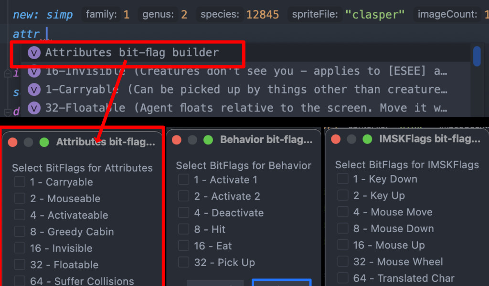
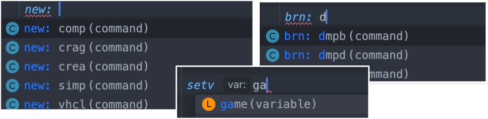
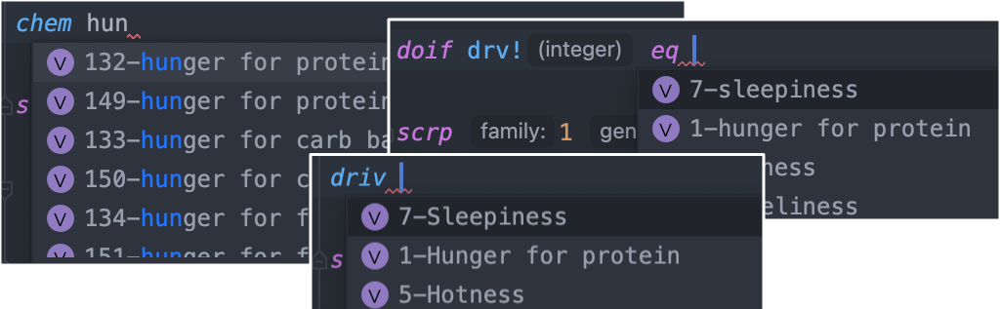

# CAOS Editor

The CAOS editor in the CAOS and Agenteering plugin features:
- Code completion
- Syntax highlighting
- Pop up documentation
- Documentation browser
- Inline hints for known value types
- Descriptive folding for DOIF statements

## Completion `ctrl+space`
There are several kinds of completion in the CAOS editor.

**To get a list of completion items use `ctrl+space` on Windows or macOS**

### Bitflag Completion*
Commands that take a bitflag value such as `ATTR`, `BHVR`, `IMSK` will feature an autocomplete
item starting with the command and ending with `bitflag builder`. i.e. `ATTR bitflag builder`  

### Command completion
Command autocompletion is aware of the need for a command, lvalue or rvalue. 
If a command does not come up when you think it should, it may be that the command 
is not of the right type such as using an rvalue such as `chem 10` were an lvalue like `va00` is expected
If the plugin is incorrect, please file an issue on the [github issue tracker](https://github.com/bedalton/Caos-Plugin-IntelliJ/issues)

### Known Value Completion
The CAOS plugin can potentially filter a known numeric value by its named value.  

Typing `driv hun` would show autocompletion results for drives containing `hun` such 
as `hunger for protein`. 
Hitting enter while the right option is selected, will insert the **numeric** value

Known value completion also works on opposing sides of equality statements. Typing 
`doif drv! eq hun` would also show autocompletion results for drives containing hunger

### CLAS completion
For C1 agents, an autocompletion result called `Generate CLAS value` 
will show a popup window allowing you to set family+genus+species which will insert the 
appropriate integer value representing that class

## Intention Actions `alt+enter`

Some problems detected by the plugin have fixes that can applied automatically. 
With the cursor on an error element, pressing alt+enter will show you any fixes if available.
ost fixes are related to PRAY and CAOS2Pray file references

### Dependency Order Fix
In PRAY files, missing or incorrectly numbered dependencies can be renumbered 
by pressing `alt+enter` next to the dependency count. 
This will show an option to re-order dependencies  
*NOTE: this is a destructive operation. 
It will remove any comments within the body of agent block*

### File Name Case Fix
If a file has an incorrectly cased file, the plugin may suggest a fix for fixing case

### C1 Remove Too many spaces
If there are too many spaces between elements, you can remove them by pressing `alt+enter` and choosing this fix.

### Place commands on separate lines
In cases where code is all on a single line, 
you may place the cursor next to a non-control command word, press `alt+enter`, and 
select the option to expand commands onto separate lines.  
This will also indent the file for greater readability 

## Popup Documentation

Holding `ctrl` on Windows, or `CMND` on macOS and hovering over a command will
show a popup with basic command information such as parameters and a short description

## Code navigation `CTRL`/`CMND`

Holding `ctrl` on Windows, or `cmnd` on macOS and clicking a command will navigate to the included 
CAOS documentation within the plugin. 

Clicking on files names in CAOS or PRAY files will attempt to open the named file,
if it can be resolved to a file within the project/module

## Plugin CAOS Documentation

The plugin ships with some CAOS documentation in a plugin specific format.
Coloring for this documentation is available in the `Editor`->`Color Scheme`->`CAOS Command Definitions` panel in settings/preferences

Clicking `@{something}`text next to a parameter type will take you to a list of its value descriptions.  
i.e. `integer@movs` takes you to a list of possible `mov` values

`#{something}` will show up a popup list with commands related to this item

`@RequiresOwnr` Means this command requires an owner object. I.e. can only be used in event scripts

`@RequiresOwnrCreature` Means this command should only be used in event scripts where `OWNR` is a creature

`@lvalue` means this command is a lvalue and can be used as a variable when a lvalue is needed

`@rvalue`  means this command is a rvalue and can be used as a value when a rvalue is needed
