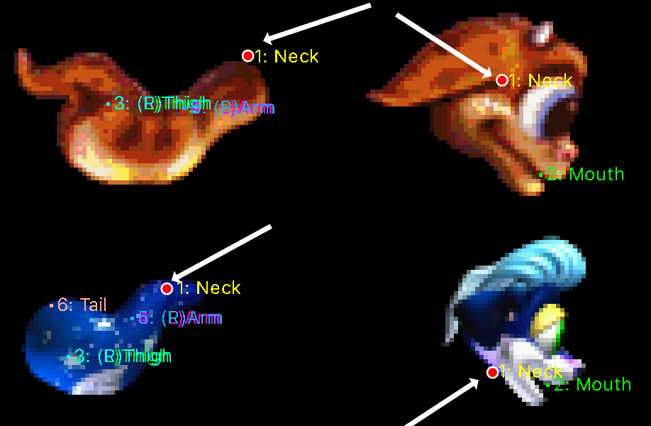
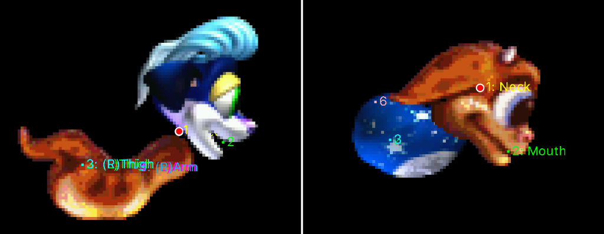
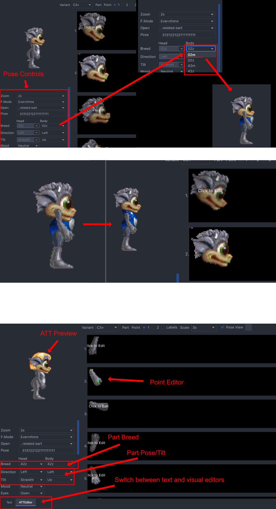
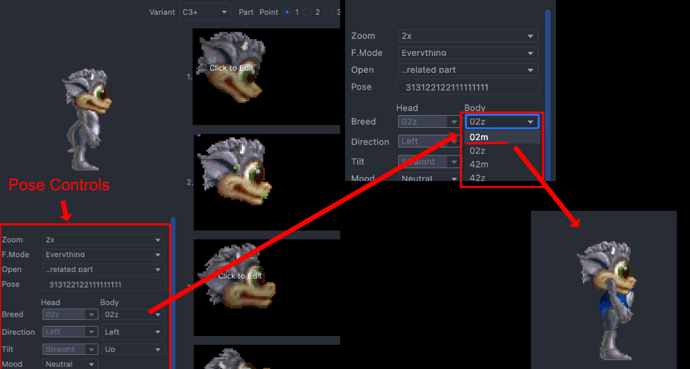
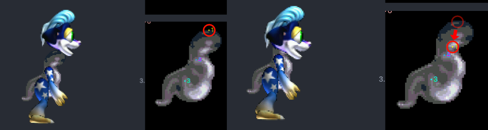

# Converting ATTs between C1/C2 and C3/DS

## The Problem
C1/C2 have body attachment points in different locations than C3/DS -- 
especially the head and neck.

### Heads
- **C1/C2** - breeds have the neck point toward the center of the head
- **C3/DS** - on the outside edge of the head

### Bodies
- **C1/C2** - bodies have the neck point slightly outside the body    
- **C3/DS** - bodies have the neck point recessed inside the neck.

### Result
The difference in the points is more immediately clear   
**C1/C2 BODY -> C3/DS HEAD** - The head floating above the body  
**C3/DS BODY -> C1/C2 HEAD** - The head too low down on the body  

## The tools

This guide relies on the ATT editor provided by the **Creatures CAOS and Agenteering** plugin 
running inside the **[IntelliJ IDEA IDE](https://www.jetbrains.com/idea/download)**. 
To get started with IDEA and CAOS and Agenteering plugin, see this [Getting started guide](./Installation.md)

### Attachment Points
Along the top of the editor are radio buttons with a number beside them. These numbers represent a point in the ATT

To switch the point being edited:  
- Click the radio button
- **Press the corresponding number key on the keyboard**

**X/Y lock**
Pressing `x` on the keyboard will lock the all points x-axis movement  
Pressing `y` will lock the points y-axis movement

## Project Layout

### 1. Create Project
Begin by creating a project to organize your files
1. `File` -> `New Project`
2. Choose `CAOS Script` on the left side panel
3. Click `next` on the right side panel
4. Choose project name, location and variant. If creating a breed for C3, choose `Creatures 3`
5. Add Files

### 2. Add and Organize Files  

For best results, the ATTs cannot be edited in isolation. 
1. Put your newly converted breed ATTs and sprites(1) in a subfolder together or in separate Image/Body Data folders
   1. An official breed's ATTs and Sprites from your target game.(2) *Though you can copy all Breeds together, copying only one of the official breeds will
      make navigation between the breeds easier.*
      Finding a specific breeds file is easier with glob syntax where you can substitute `?` for any one letter or number  
      *Example*: Astro male body data `?0?m.att`, Astro norn Female `?4?m.att`
- On Windows glob syntax works in Explorer's search and CMD using `copy`
- On macOS, glob syntax only works in terminal with the `cp` command. When using Finder search, 
you would have to use "ends with" to get files by breed letter, and select actual files manually

__Note 1:__ - If you have not yet converted the sprites, you can try converting them
with Sprite-Util program as outlined in 
the [Sprite-Util Breed Conversion Guide](https://github.com/bedalton/creatures-sprite-util-node/blob/main/ConvertBreed.md)  

__Note 2:__ In C3/DS there are two slightly different sets of ATTs.
The first 3 breeds: Bruin, Bengal and Civet, have ATTs that differ from all the later official breeds which use the ChiChi ATTs.

## Opening Breed Files
There are three basic ways to open a breed files.
- Find and double-click the file in project view on the left side project hierarchy view.
  - Typing the file name while project view has focus will attempt to highlight it
- Hit `shift` twice while focus is on editor or project view to open the quick action dialog
  - Type the file name into the text field and click it or press enter with the file name highlighted
- In editor view, you can click the combo-box `... related files` next to `Open` on the left side pose editor panel
  - This will show you the related breed files, clicking on an item will open it up

## One man's method

### Project Layout
In this example we will convert C1 Albian Greys to C3DS using Norn Z.  
My Project Structure has:
- ROOT
    - AlbianGrey
      - Albian Grey: ATTS and C16s
    - Other Breed Files
      - Astro Norn: ATTS and C16s

### The head

Making converted breeds plays nice involves a lot of back and forth. 
You will be swapping the reference breed with your converted breed parts back and forth.

I start with the head, which we will need to revisit several times.

I start by clicking on a converted head ATT. Here it will be `a00z.att`
I then click the combo-box under body, and select the C3 reference breed, in this case Norn M, or Astro Norn

As you can see, the head is down far too low on the body. The result of the C1e head point and the C2e neck point

The next step is to click on each frame of the head on the right-hand side, and move the point 1/neck point 
to a location that positions the head on the neck of the reference norn properly

If converting C1e to C2e, it is best to set points on pose 9(front facing), 
and copy it across 10-12(other front facing), 
and then to set points on 13(back facing), and copy 14-16 (other back facing), 
as these poses will post likely be the same

### The Body
After fitting the head properly on the reference breed's body open the **converted** breed's body.
In this case the Albian Grey body.

Now change the breeds of the head, arms, legs and tail to the referenced breed.
Take time moving points 1-6 of the body to better align with the reference breeds points. 

Be sure to try different poses/tilts of the head and limbs to find the point that best matches all of them. 

Some angles may never look right, so match as many tilts as you can, as well as you can.

Arms and legs may need only little adjustments, or none at all.

### The Limbs
Now repeat the process done for the head, with the tail, the left and right thigh and the left and right shoulders \-\-
which was replacing the converted breed's body with the body with your reference breed.

I find it easier to work with the left and right limbs at the same time. 

1. I start by setting the points of one limb in its poses closest to the front. 
2. I then switch to the opposite limb's ATT, and set its 4 poses closest to the front.
3. I then move on to editing the current limbs 4 remaining side facing poses.
4. If editing the far side's limb in the `UP` position, I set the opposing limb (closest to the camera), to the `UP`
position.
5. I then move this limb's points to match the opposing limb which is at the front
   - **Focus modes help here.** Try `Ghost Mode`
6. I repeat this on each limb's far side poses

### Tweaking

**Remember, you have only been setting points on the converted breed to the reference breed, not to itself. 
You also have not altered any ATTs for the reference breed**

**__We also have only been doing the main attachment points, the thighs, upper arms, head and tail to the body, and the body to them__**

When you have set all points on the converted breed onto the reference breed, it is time to see the converted breed
on its own. Here you may find that things look a little funny. 
If the legs appear too high, you can try shifting the point down on the body a pixel or two, 
and the point up on the thigh a pixel or two.
Afterwards, swap out the parts with your reference breed, to make sure things still look okay.

Repeat this until the breed looks good both on its own and blended.

With this, your ATTs are properly edited, and should blend well with your target game's official breeds.
