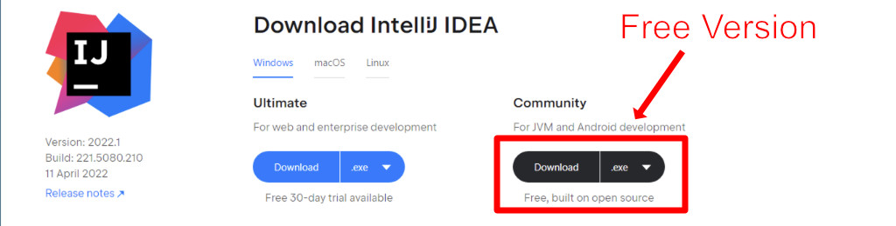
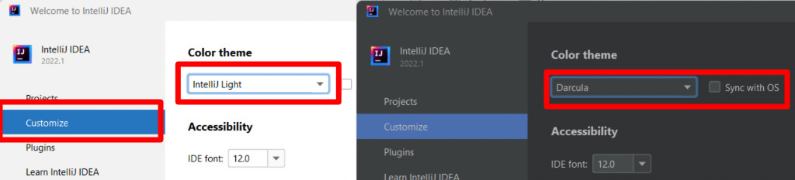
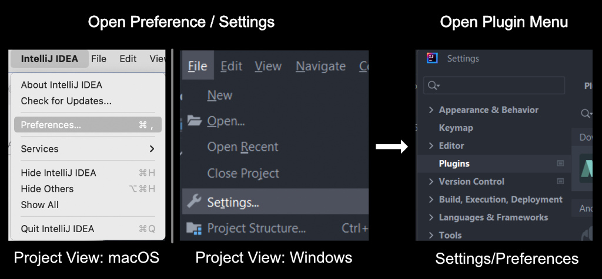
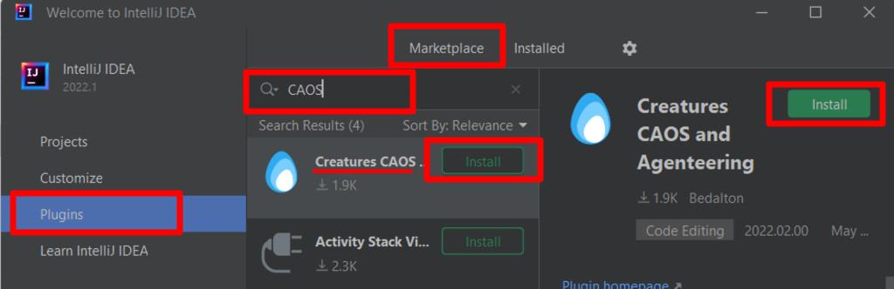
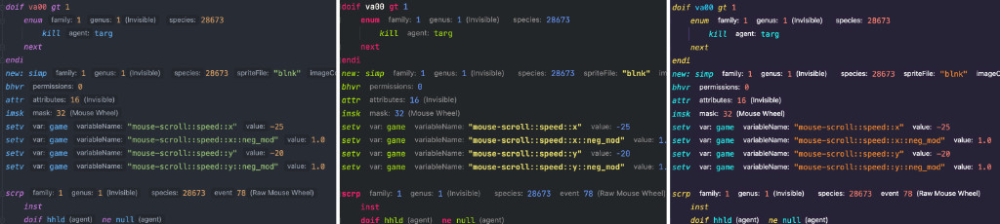
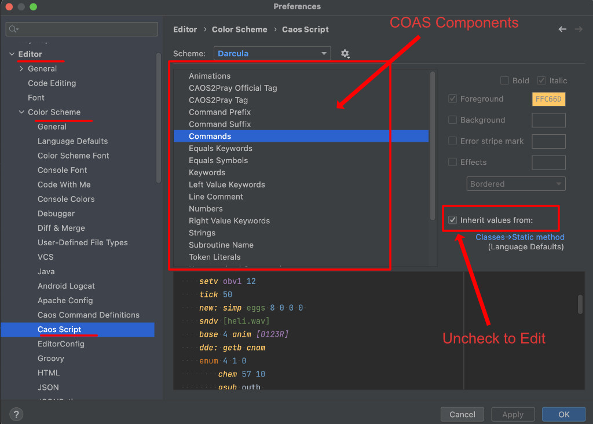
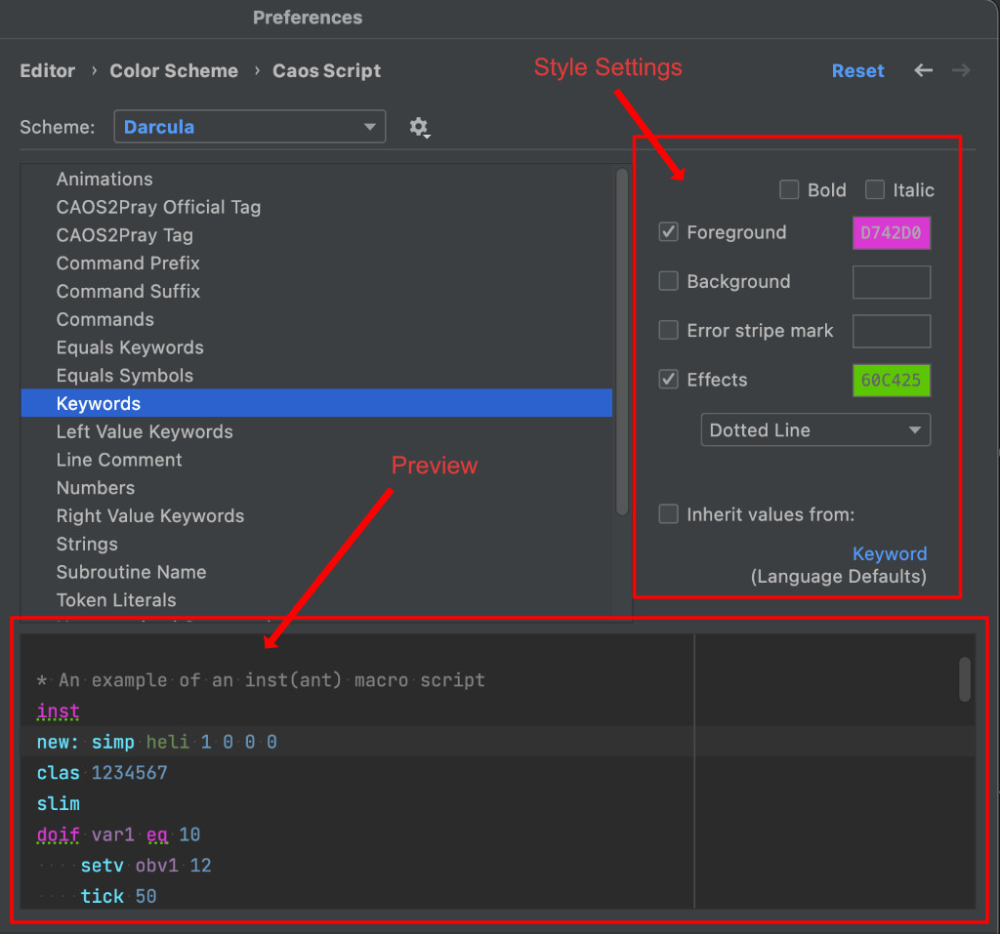

# CAOS IntelliJ Plugin Getting Started

For this guide we will be using the CAOS and Agenteering plugin
for the IntelliJ IDEA IDE

The instructions below will tell you how to download IntelliJ IDEA and
the CAOS and Agenteering plugin

## Install IDEA
To start you will need to download IDEA
1. Download and install JetBrain's IntelliJ **Community edition (It's free)** from [https://www.jetbrains.com/idea/download](https://www.jetbrains.com/idea/download)

2. Install as you would a normal program
3. Run IntelliJ IDEA.
4. **Optional** Dark Mode
   1. On the welcome screen, click customize on the left size panel
   2. Click the combo-box under `Color Theme` and choose `Darcula` or `high contrast`
   

## Install the plugin

To install the plugin you will first need to open the Plugin Panel

1. Open Plugin Panel
   - If on welcome screen click on `plugins` on the left side panel
   - Open Settings/Preferences from menu bar   
   **Windows**: `File` -> `Settings` -> Click `Plugins` on left side panel  
   **macOS**: `IntelliJ IDEA` -> `Preferences` -> Click `Plugins` on left side panel
   
2. Ensure `Marketplace` tab is selected on top tab panel
3. Type CAOS into the text box in the middle panel (or right panel if only two panels)
4. In the Creatures CAOS and Agenteering panel, click install  
*If this is your first 3rd party plugin you will need to agree to the terms*  
**Note: We collect no data**

5. Restart when asked to restart

## Project and Module  

To start using the CAOS plugin, you will need to set up a project

1. Click `New Project` in the welcome screen or go to `File` -> `New Project`
2. Select `CAOS Script` from the left-hand menu and click next or create
3. Enter the name of this project
4. Choose its location
5. Choose the variant.
6. Click "Create"

Though the project type is CAOS Script, it covers the ATT editor as well.
The variant is used throughout the project and modules to determine code
completion, injectors and ATT settings

## Color schemes

### Theme Plugins
The CAOS editor uses the system color scheme, which means it will take on the
colors of the rest of the IDE.

Additional color schemes can be installed through the plugin Marketplace.
You can browse theme plugin previews on the [Jetbrains theme plugin page](https://plugins.jetbrains.com/search?tags=Theme)

### Manual Color Scheme
You can alter the colors used by the CAOS editor directly by opening App Settings/Preferences  
Windows: `File` -> `Settings`  
macOS: `IntelliJ IDEA` -> `Preferences`  

On the left-hand side panel of the settings window
1. Expand `Editor`
2. Expand `Color Scheme`
3. Click `CAOS Script`, `PRAY` or `CAOS Command Definitions`(In-plugin documentation) 

In the panel that opens
1. Click the item you would like to color
2. Uncheck "Inherit Values From" on the right side panel

3. Edit the appearance using the controls on the right side panel  

*The bottom of the color scheme window shows a preview of the editor with the new colors*
